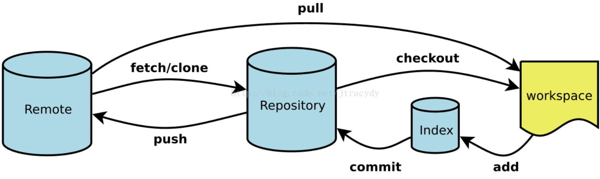

## 使用方法

1. 打开文件夹
2. 右键鼠标打开git bash here
3. git init初始化仓库
4. 

## 特性

具有历史跟踪的能力，过去对git的一些配置会留到.git文件夹里面，包括远程的一些配置（git remote）

[【VSCode ☆ Git 】代码管理进阶 ➔ Git History 插件_哔哩哔哩_bilibili](https://www.bilibili.com/video/BV1W34y1G7g4?spm_id_from=333.788.videopod.sections&vd_source=19b24b456c5eb820a6cb8e1dea6cd598)

## git的一些指令

### 配置信息

```shell
git config --global user.name "Your Name"
git config --global user.email "youremail@yourdomain.com"
git config --list
```

### 创建仓库

```shell
git init
git clone [url]
```

### 修改与提交

```shell
git add [file1] [file2] ... #添加文件
git add [dir] #添加目录
git add . #添加所有文件
```

```shell
git status 
#git status 命令会显示以下信息：
当前分支的名称。
当前分支与远程分支的关系（例如，是否是最新的）。
未暂存的修改：显示已修改但尚未使用 git add 添加到暂存区的文件列表。
未跟踪的文件：显示尚未纳入版本控制的新文件列表。
```

```shell
git commit -m [message]
$ git commit [file1] [file2] ... -m [message]
$ git commit -a #不需要执行git add直接提交
```

```shell
git checkout <branch-name> #切换分支
git checkout -b <new-branch-name> #创建分支并切换到它
git checkout tags/<tag-name> #切换到标签处
```

### 远程命令

```shell
git pull [远程仓库名] [分支名] #拉去仓库的分支合并到自己的分支
git pull origin master:brantest #拉取特定分支与特定分支合并
```

```shell
git push <远程主机名> <本地分支名>:<远程分支名> #推送本地分支到远程仓库
git push <远程主机名> <本地分支名> #如何分支名相同则可以省略后面一项
git push origin --delete <branchname> #删除远程分支
```

```shell
git remote #列出当前仓库中已配置的远程仓库。
git remote -v #列出当前仓库中已配置的远程仓库，并显示它们的 URL。
git remote add <remote_name> <remote_url> #添加一个新的远程仓库。指定一个远程仓库的名称和 URL，将其添加到当前仓库中。
git remote rename <old_name> <new_name> #将已配置的远程仓库重命名。
git remote remove <remote_name> #从当前仓库中删除指定的远程仓库。
git remote set-url <remote_name> <new_url> #修改指定远程仓库的 URL。
git remote show <remote_name> #显示指定远程仓库的详细信息，包括 URL 和跟踪分支。
```

### 分支管理

```shell
git checkout -b <branchname> #创建分支
git checkout (branchname) #切换分支
git branch #查看本地分支
git branch -r #查看远程分支
git branch -a #查看所有远程和本地分支
git branch -d <branchname> #删除本地分支

```

```shell
git merge <branchname> #合并分支

```

### 查看历史信息

```shell
git log [选项] [分支名/提交哈希]
-p：显示提交的补丁（具体更改内容）。
--oneline：以简洁的一行格式显示提交信息。
--graph：以图形化方式显示分支和合并历史。
--decorate：显示分支和标签指向的提交。
--author=<作者>：只显示特定作者的提交。
--since=<时间>：只显示指定时间之后的提交。
--until=<时间>：只显示指定时间之前的提交。
--grep=<模式>：只显示包含指定模式的提交消息。
--no-merges：不显示合并提交。
--stat：显示简略统计信息，包括修改的文件和行数。
--abbrev-commit：使用短提交哈希值。
--pretty=<格式>：使用自定义的提交信息显示格式。
```

### 标签

```shell
git tag <tagname> #给某个特定版本添加快照
git tag -a v1.0  #可以添加注释
git push origin <tagname> #推送标签到远程仓库
git push origin --tags #推送所有标签
git tag -d <tagname> #本地删除标签
git push origin --delete <tagname> #远程删除标签
```


