# 目标文件格式

## 引入

### **1. 早期的目标文件**

在计算机早期，目标文件格式相对简单，主要用于存储编译器生成的机器码。主要特点有：

- **简单的二进制文件**：只包含纯机器码，没有复杂的符号和重定位信息。
- **固定的结构**：各个模块之间的接口和地址信息由汇编程序手动管理，适用于当时规模较小、模块间依赖较少的程序。

随着程序复杂度的提高，需要支持模块化编程和链接，目标文件中开始加入符号表和重定位信息，以便链接器能将各个模块合并并解决符号引用。

------

### **2. a.out 格式**

在 Unix 系统早期，**a.out** 格式成为了一种标准目标文件格式。其主要特点包括：

- **包含段信息**：将代码、数据、BSS 段等分别存储。
- **符号表与重定位信息**：支持模块间的符号引用，便于链接。
- **缺点**：a.out 格式较为简单，灵活性和扩展性有限，随着系统需求增长，其局限性逐渐暴露。

------

### **3. COFF（Common Object File Format）**

为了解决 a.out 的不足，**COFF** 格式被提出，主要用于 Unix 系统和早期的 Windows 开发环境。COFF 格式的特点：

- **标准化结构**：包含文件头、段表、符号表和字符串表等，支持更多的调试信息和扩展数据。
- **模块化支持**：更好地支持大规模软件工程的模块化编程和多文件链接。
- **Windows 应用**：微软最初采用 COFF 格式作为其编译器生成的目标文件格式，便于跨平台和多工具链的使用。

------

### **4. ELF（Executable and Linkable Format）**

随着开源运动和 Unix 系统的发展，**ELF** 格式（可执行与可链接格式）逐渐成为 Linux 和多数现代 Unix 系统的标准目标文件格式。ELF 格式的特点包括：

- **灵活性和扩展性**：分离了程序头表和段表，可以同时用于可执行文件、共享库、目标文件和核心转储（core dump）。
- **动态链接支持**：支持动态链接（Shared Linking）机制，能够在运行时加载共享库，降低可执行文件的体积。
- **清晰的结构**：ELF 头定义了文件的整体布局，程序头表描述如何将文件加载到内存，段表记录具体的代码、数据等信息。
- **广泛应用**：几乎所有 Linux 系统都采用 ELF 格式，成为现代软件开发的重要基础。

------

### **5. Windows PE（Portable Executable）格式**

在 Windows 平台上，**PE 格式**（Portable Executable）是主要的目标文件格式，它实际上是基于 COFF 格式进行扩展的。PE 格式的特点：

- **基于 COFF**：继承了 COFF 的基本结构，同时添加了 Windows 专用的信息，如导入表、导出表、资源段等。
- **支持动态链接**：Windows 的 DLL（动态链接库）采用 PE 格式，通过动态链接器（Loader）在运行时加载。
- **图形化和调试信息**：PE 格式提供了丰富的调试信息和数据，便于开发者使用 Visual Studio 等工具进行调试和分析。

------

### **6. 其他目标文件格式**

除了上述主要格式外，还有一些其他格式：

- **Mach-O**：苹果 macOS 和 iOS 系统使用的目标文件格式，支持动态链接和共享库。
- **OMF（Object Module Format）**：曾在 DOS 和 Windows 早期开发环境中使用，后来逐渐被 COFF/PE 取代。

------

### **7. 目标文件格式发展的意义**

目标文件格式的发展反映了软件开发的需求变化和计算机硬件、操作系统的进步：

- **模块化和可重用性**：早期简单的格式无法很好支持大型软件工程，而现代格式（如 ELF 和 PE）通过符号表、重定位信息、调试信息的集成，使得软件模块之间的链接和重用更加方便。
- **动态链接与共享库**：现代目标文件格式支持动态链接，可以使多个程序共享相同的库代码，从而节省内存和磁盘空间，简化更新过程。
- **跨平台支持与标准化**：ELF、PE、Mach-O 等格式使得软件在不同平台间的移植和开发变得更为标准化，促进了软件生态系统的发展。

## ELF的介绍

### ELF的结构：

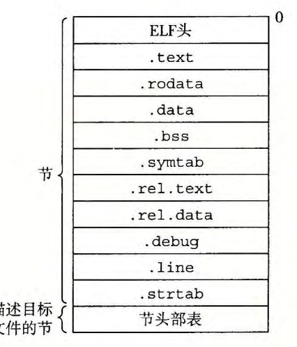

具体内容可以参考《深入理解计算机系统》7.4

### 符号表.symtab

符号表对于目标模块的链接与重定位有重大的意义

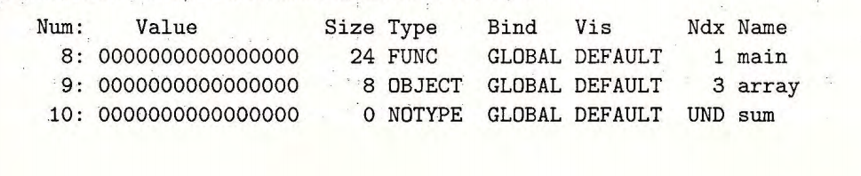

Ndx 是它在section中的第几节

size是大小

value是在这一节的偏移量

### 符号解析

#### 强符号与弱符号

在C语言中，编译器默认函数和初始化了的全局变量为强符号（Strong Symbol），未初始化的全局变量为弱符号（Weak Symbol）。强符号之所以强，是因为它们拥有确切的数据，变量有值，函数有函数体；弱符号之所以弱，是因为它们还未被初始化，没有确切的数据。

链接器会按照如下的规则处理被多次定义的强符号和弱符号：
**1)** 不允许强符号被多次定义，也即不同的目标文件中不能有同名的强符号；如果有多个强符号，那么链接器会报符号重复定义错误。

**2)** 如果一个符号在某个目标文件中是强符号，在其他文件中是弱符号，那么选择强符号。

**3)** 如果一个符号在所有的目标文件中都是弱符号，那么选择其中占用空间最大的一个。

需要注意的是，`__attribute__((weak))`只对链接器有效，对编译器不起作用，编译器不区分强符号和弱符号，只要在一个源文件中定义两个相同的符号，不管它们是强是弱，都会报“重复定义”错误。

[13.强符号和弱符号 - 夜行过客 - 博客园](https://www.cnblogs.com/yongdaimi/p/8084634.html) 

### 静态库

#### 静态库的解析过程

在读入main.o 时 会在E加入main.o  U加入main.o中为定义的函数与变量  D中加入以定义的函数与变量，逐次进行，当结束时U为空则成功，不为空则报错，最后将E中的目标文件整合成一个可执行文件

（注：静态库视为各个目标文件的总和，添加到E的应是各个目标文件）

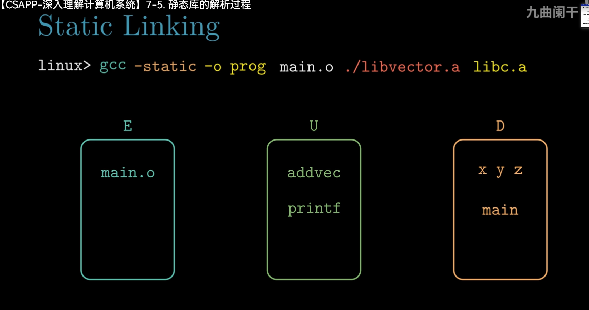

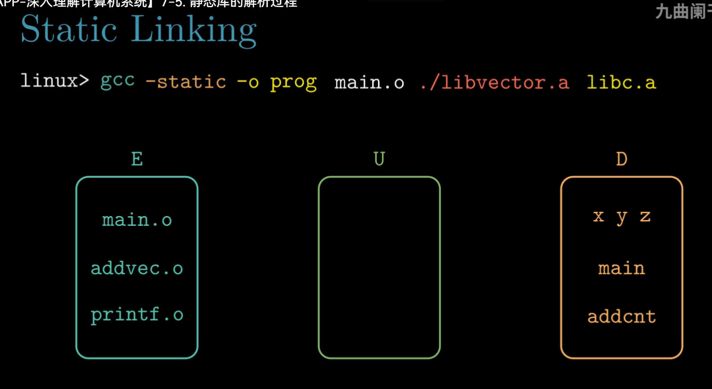

### 重定位

分两步执行，第一步是重定位节和符号定义

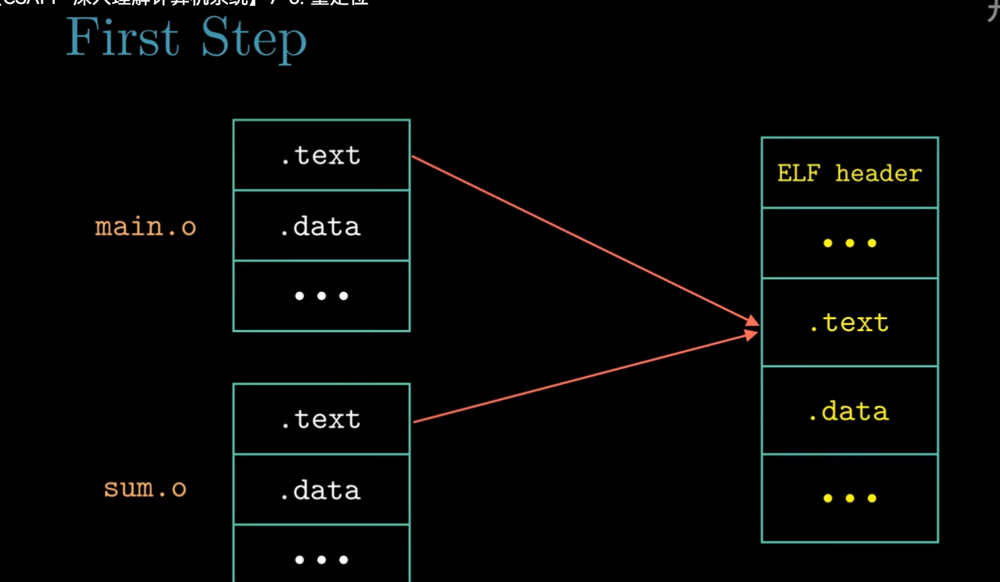

第二步是重定位节中的符号引用，而这依赖于重定位条目

.rel.text   .rel.data

重定位条目里数据的数据结构

（注:type有32种图中只列出了常见的两种)

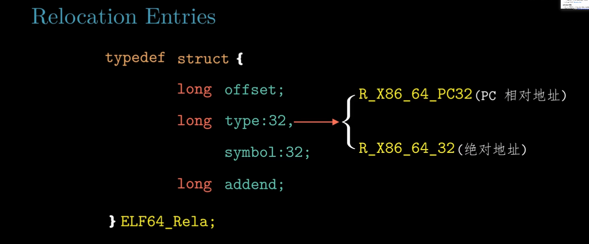

#### 相对地址

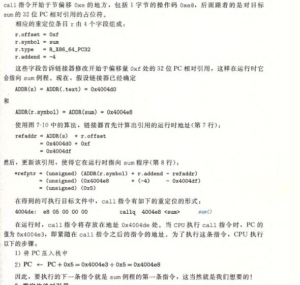

总结一下就是会计算出引用指令与函数的地址之间的差值，然后在得到的可执行文件中将call的值修改为偏移＋pc的值

#### 绝对地址

通过下面计算出偏移的位置然后修改地址，offset是修改从偏移量为0xa位置的绝对引用，0x9+0x1=0xa

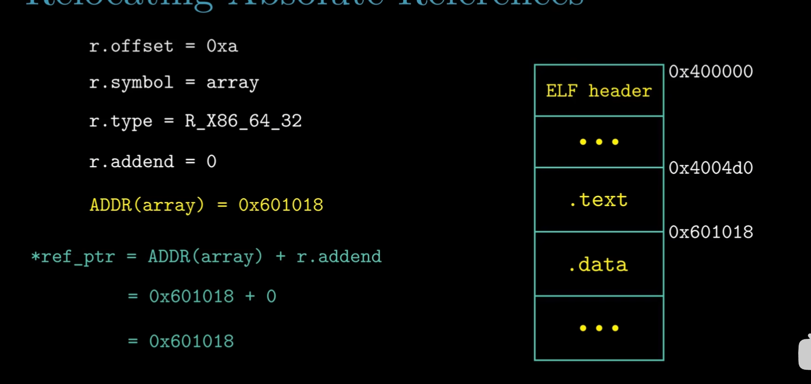

## 可执行文件

### 结构

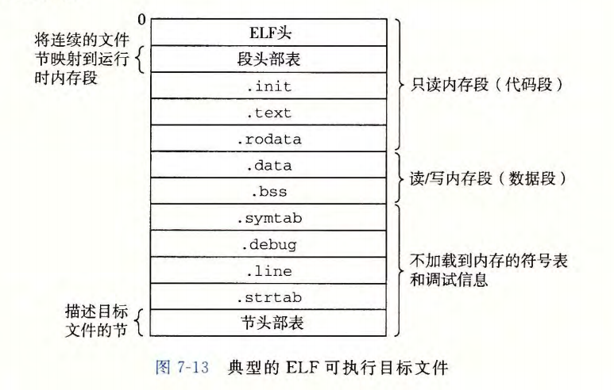

### 可执行文件的加载

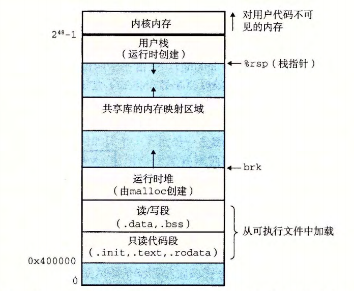

## 动态链接共享库

#### 特点

**运行时加载**：程序在运行时由操作系统的加载程序加载所需的库，而不是在编译时将库的内容直接包含到可执行文件中。

**共享性**：多个应用程序可以同时使用同一个动态链接库的实例，节省系统资源。

**模块化和可维护性**：库的更新或修复可以独立于应用程序进行，无需重新编译或链接应用程序。

#### 原理

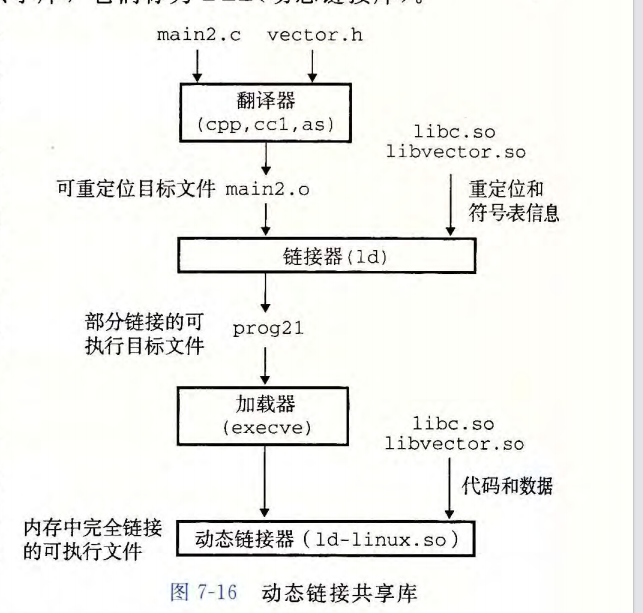

动态链接共享库在实现运行时链接、库实例的共享的过程中有两个很重要的东西：（1）加载器 （2）动态链接器

#### 运行使用动态链接库的方法

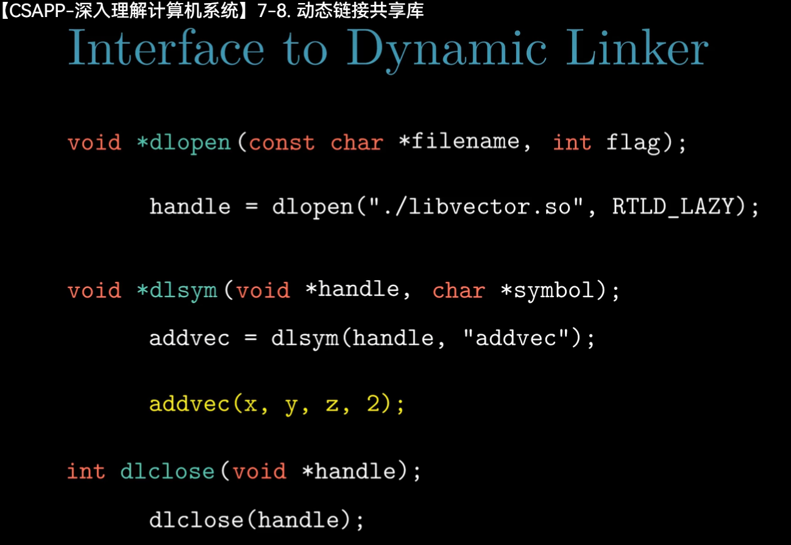

#### 位置无关代码

为了避免直接修改代码段带来的危险，所以使用间接跳转的方法，提供了一个got表和plc表来实现数据与函数的重定位

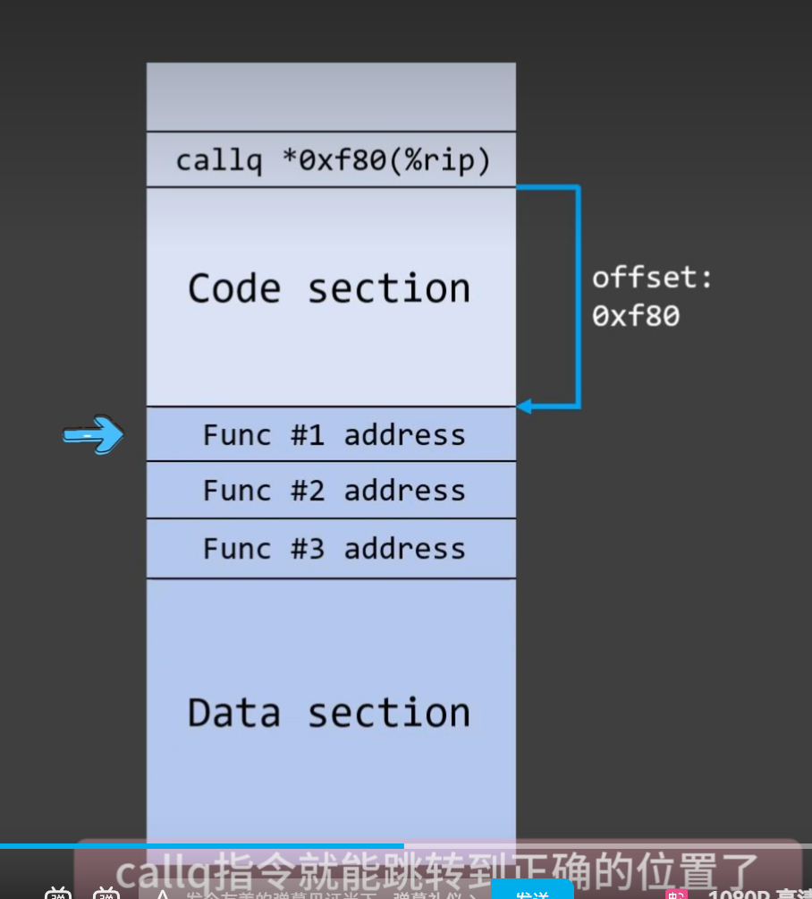